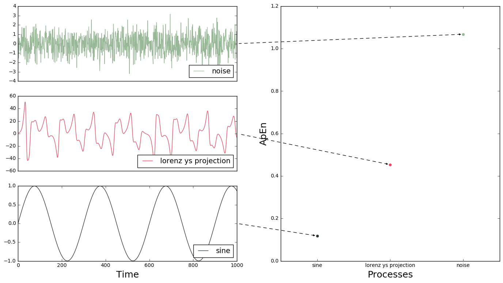

#### Quantifying the predictability of time-series

Approximate Entropy (ApEn), introduced by [Pincus et al. (1991)](https://link.springer.com/article/10.1007/BF01619355), is a simple method for measuring the creation/destruction of patterns in time-series. Thus, one can use it to quantify the predictability of a time-series, and afterwards determine if a statistical model should be retrained or if it would be better to avoid trying to predict that particular time-series.

Particularly, ApEn can be used to filter financial time-series and enhance forecast done with genetic programming. You can access a basic implementation of ApEn [[code]](https://github.com/lkania/Approximate-Entropy) and a description of its utility and relation to other measures like the Kolmogorov-Sinai Entropy [[brief]]().
